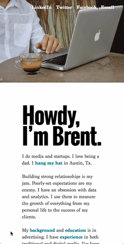
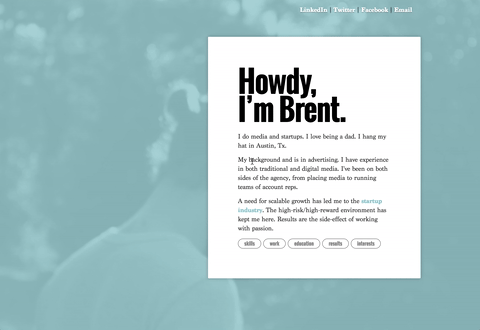
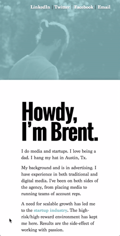

#BrentMart.in
A personal portfolio site. Visit the [live version](http://brentmart.in/).

### Description
This is an overhaul of the original portfolio site. The purpose of moving this into a repository was to practice new development skills with code that actually gets shipped on a regular basis. This README serves as a *technical summary of all the changes I have made* to the site and how I did them. It is exhaustive.


### What it is showing
So far, this primarily shows JavaScript/JQuery. The goal to learn something _ground level_ with JavaScript before working with something more _high level_ like React or Angular.

<br>
<br>
## Version 1.0 - Original
<p>&nbsp; Tablet &nbsp;&nbsp;&nbsp;&nbsp;&nbsp; &nbsp;&nbsp;&nbsp;&nbsp;&nbsp; &nbsp;&nbsp;&nbsp;&nbsp;&nbsp; &nbsp;&nbsp;&nbsp;&nbsp;&nbsp; &nbsp;&nbsp;&nbsp;&nbsp;&nbsp; &nbsp;&nbsp;&nbsp;&nbsp;&nbsp; &nbsp;&nbsp;&nbsp;&nbsp;&nbsp; &nbsp;&nbsp;&nbsp;&nbsp;&nbsp; &nbsp;&nbsp;&nbsp;&nbsp;&nbsp; Desktop &nbsp;&nbsp;&nbsp;&nbsp;&nbsp; &nbsp;&nbsp;&nbsp;&nbsp;&nbsp; &nbsp;&nbsp;&nbsp;&nbsp;&nbsp; &nbsp;&nbsp;&nbsp;&nbsp;&nbsp; &nbsp;&nbsp;&nbsp;&nbsp;&nbsp; &nbsp;&nbsp;&nbsp;&nbsp;&nbsp; &nbsp;&nbsp;&nbsp;&nbsp;&nbsp; &nbsp;&nbsp;&nbsp;&nbsp;&nbsp; &nbsp;&nbsp;&nbsp;&nbsp;&nbsp; &nbsp;&nbsp;&nbsp;&nbsp;&nbsp; &nbsp;&nbsp;&nbsp;&nbsp;&nbsp; &nbsp;&nbsp;&nbsp;&nbsp;&nbsp; &nbsp;&nbsp;&nbsp;&nbsp;&nbsp; &nbsp;&nbsp; Mobile</p>
<p align="center" margin-bottom="none">
  
  
  
</p>
<br>
<br>
***
<br>
<br>
## Version 2.0 - JavaScript
<p>&nbsp; Tablet &nbsp;&nbsp;&nbsp;&nbsp;&nbsp; &nbsp;&nbsp;&nbsp;&nbsp;&nbsp; &nbsp;&nbsp;&nbsp;&nbsp;&nbsp; &nbsp;&nbsp;&nbsp;&nbsp;&nbsp; &nbsp;&nbsp;&nbsp;&nbsp;&nbsp; &nbsp;&nbsp;&nbsp;&nbsp;&nbsp; &nbsp;&nbsp;&nbsp;&nbsp;&nbsp; &nbsp;&nbsp;&nbsp;&nbsp;&nbsp; &nbsp;&nbsp;&nbsp;&nbsp;&nbsp; Desktop &nbsp;&nbsp;&nbsp;&nbsp;&nbsp; &nbsp;&nbsp;&nbsp;&nbsp;&nbsp; &nbsp;&nbsp;&nbsp;&nbsp;&nbsp; &nbsp;&nbsp;&nbsp;&nbsp;&nbsp; &nbsp;&nbsp;&nbsp;&nbsp;&nbsp; &nbsp;&nbsp;&nbsp;&nbsp;&nbsp; &nbsp;&nbsp;&nbsp;&nbsp;&nbsp; &nbsp;&nbsp;&nbsp;&nbsp;&nbsp; &nbsp;&nbsp;&nbsp;&nbsp;&nbsp; &nbsp;&nbsp;&nbsp;&nbsp;&nbsp; &nbsp;&nbsp;&nbsp;&nbsp;&nbsp; &nbsp;&nbsp;&nbsp;&nbsp;&nbsp; &nbsp;&nbsp;&nbsp;&nbsp;&nbsp; &nbsp;&nbsp; Mobile</p>
<p align="center" margin-bottom="none">
  
  
  
</p>

<br>
### What's in this version
The initial update was focused on breaking up the content into digestible chunks. The original version has all the content placed inside one long block, requiring you to seek out information that you want. For instance, if you wanted to look up my **work history**, you would have to scroll past other content before you reached it. Updates for this version breaks up the content using JQuery.

The content can be divided into five sections (skills, jobs, education, results, and interests) with each assigned an id `<div id="skills"></div>`in html to be used as anchors strictly for JavaScript, **not** CSS styling.

<br>
### How its done
Buttons were then created as a list under the introductory content at the top of the site, and given a class `button-off` for initial before they are engaged:
```html
<ul>
  <li class="button-off">skills</li>
  <li class="button-off">work</li>
  <li class="button-off">education</li>
  <li class="button-off">results</li>
  <li class="button-off">interests</li>
</ul>
```
And then styled:
```CSS
.button-off {
	font-family: 'Oswald', Helvetica, sans-serif;
	font-size: .75em;
	font-weight: 400;
	background-color: white;
	border: 1px solid #707070;
	border-radius: 3.75em;
	color: #848484;
	display: inline-block;
	line-height: 1;
	padding: 0.4em 1.2em;
	transition: all 100ms linear;
}
```

Now to access this, we need to use JavaScript. We'll start by writing some JQuery to find the button, set it up to trigger an action when clicked, find the class, and have that trigger cause an expanding or contracting action.

Using **jobs** as our example, we find the respective child by using `.find` on the list of `li`'s. The `#textbox` id is already assigned to the _full_ content that all sections and the intro. Then we set up a trigger event to engage the button when clicked by using `on('click', function() {});`. The function starts by looking like so:
```javascript
$('#textbox').find('li:nth-child(2)').on('click', function() {
});
```

With the button selected when a trigger event set when clicked, we need to put in the actions that happen when triggered.

We can make the content expand by using a `.fadeToggle()` in JQuery. We find it by traversing up to `#textbox`, and then back down to the anchor tags we set earlier `#jobs` we now have:
```javascript
$('#textbox').find('li:nth-child(2)').on('click', function() {
  $(this).closest('#textbox').find('#jobs').fadeToggle(250);
});
```

But if we plan on using a toggle to expand/contract content when the buttons are clicked, then we need to style the button to reflect that as well. We can do so by creating another class `button-on` to _add_ to the button when its clicked and in the same motion we can _remove_ the `button-off` class that already existed. Now we have:
```javascript
$('#textbox').find('li:nth-child(2)').on('click', function() {
  $(this).toggleClass( 'button-off button-on' );
  $(this).closest('#textbox').find('#jobs').fadeToggle(250);
});
```
And, of course, we would need to style `button-on` as well:
```CSS
.button-on {
	background-color: teal;
	border: 1px solid teal;
	color: white;
  transition: all 100ms linear;
}
```

At this point we have now broken the content into 5 major chunks, accessible only by engaging buttons.

For this version, I also decided to take it a step further and break down each of the 5 sections into _basic_ information and _detailed_ information, and used a `read more` button to allow that triggering independently in each section, but I'm going to save the specifics of that for the next section.

<br>
<br>
***
<br>
<br>
## Version 3.0 - Content
<p>&nbsp; Tablet &nbsp;&nbsp;&nbsp;&nbsp;&nbsp; &nbsp;&nbsp;&nbsp;&nbsp;&nbsp; &nbsp;&nbsp;&nbsp;&nbsp;&nbsp; &nbsp;&nbsp;&nbsp;&nbsp;&nbsp; &nbsp;&nbsp;&nbsp;&nbsp;&nbsp; &nbsp;&nbsp;&nbsp;&nbsp;&nbsp; &nbsp;&nbsp;&nbsp;&nbsp;&nbsp; &nbsp;&nbsp;&nbsp;&nbsp;&nbsp; &nbsp;&nbsp;&nbsp;&nbsp;&nbsp; Desktop &nbsp;&nbsp;&nbsp;&nbsp;&nbsp; &nbsp;&nbsp;&nbsp;&nbsp;&nbsp; &nbsp;&nbsp;&nbsp;&nbsp;&nbsp; &nbsp;&nbsp;&nbsp;&nbsp;&nbsp; &nbsp;&nbsp;&nbsp;&nbsp;&nbsp; &nbsp;&nbsp;&nbsp;&nbsp;&nbsp; &nbsp;&nbsp;&nbsp;&nbsp;&nbsp; &nbsp;&nbsp;&nbsp;&nbsp;&nbsp; &nbsp;&nbsp;&nbsp;&nbsp;&nbsp; &nbsp;&nbsp;&nbsp;&nbsp;&nbsp; &nbsp;&nbsp;&nbsp;&nbsp;&nbsp; &nbsp;&nbsp;&nbsp;&nbsp;&nbsp; &nbsp;&nbsp;&nbsp;&nbsp;&nbsp; &nbsp;&nbsp; Mobile</p>
<p align="center" margin-bottom="none">
  
  
  
</p>
<br>
<br>
***
<br>
<br>
## Version 4.0 - Navigation
<p>&nbsp; Tablet &nbsp;&nbsp;&nbsp;&nbsp;&nbsp; &nbsp;&nbsp;&nbsp;&nbsp;&nbsp; &nbsp;&nbsp;&nbsp;&nbsp;&nbsp; &nbsp;&nbsp;&nbsp;&nbsp;&nbsp; &nbsp;&nbsp;&nbsp;&nbsp;&nbsp; &nbsp;&nbsp;&nbsp;&nbsp;&nbsp; &nbsp;&nbsp;&nbsp;&nbsp;&nbsp; &nbsp;&nbsp;&nbsp;&nbsp;&nbsp; &nbsp;&nbsp;&nbsp;&nbsp;&nbsp; Desktop &nbsp;&nbsp;&nbsp;&nbsp;&nbsp; &nbsp;&nbsp;&nbsp;&nbsp;&nbsp; &nbsp;&nbsp;&nbsp;&nbsp;&nbsp; &nbsp;&nbsp;&nbsp;&nbsp;&nbsp; &nbsp;&nbsp;&nbsp;&nbsp;&nbsp; &nbsp;&nbsp;&nbsp;&nbsp;&nbsp; &nbsp;&nbsp;&nbsp;&nbsp;&nbsp; &nbsp;&nbsp;&nbsp;&nbsp;&nbsp; &nbsp;&nbsp;&nbsp;&nbsp;&nbsp; &nbsp;&nbsp;&nbsp;&nbsp;&nbsp; &nbsp;&nbsp;&nbsp;&nbsp;&nbsp; &nbsp;&nbsp;&nbsp;&nbsp;&nbsp; &nbsp;&nbsp;&nbsp;&nbsp;&nbsp; &nbsp;&nbsp; Mobile</p>
<p align="center" margin-bottom="none">
  
  
  
</p>
